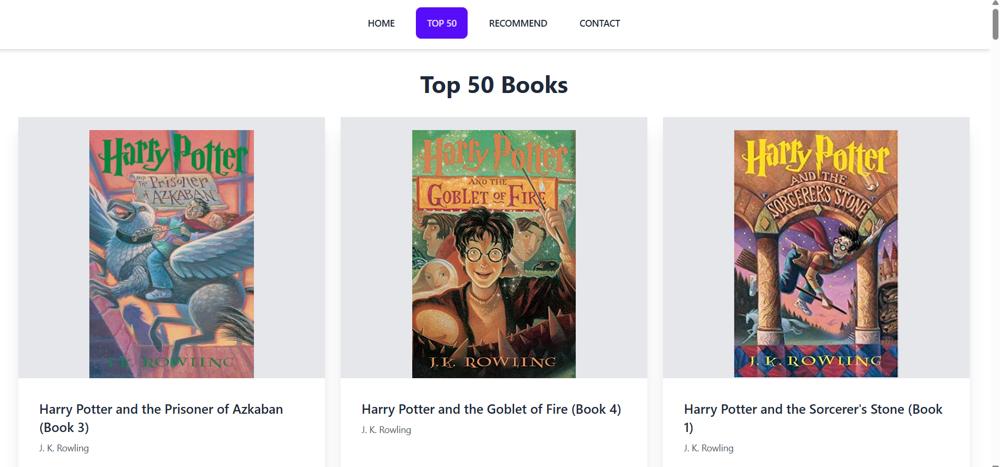
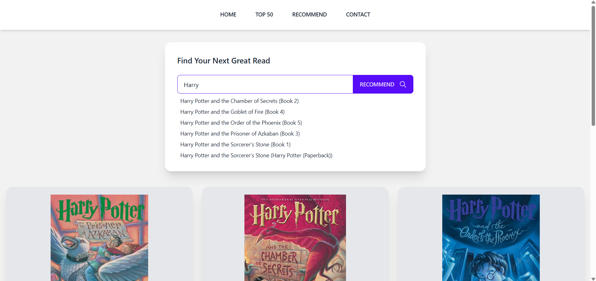

# Book Recommender System

This is a full stack project which uses HTML, CSS for frontend and Flask for backend.

### Features
- Users can explore the Top-50 highest rated books.

- Users can get recommendations based on their preferences

### Screenshots
- Top - 50 Books
    
- Personalised Recommendations

    

### Deployment 
- The application is deployed on render.

- [Click here to visit website ](https://book-recommender-beq8.onrender.com)